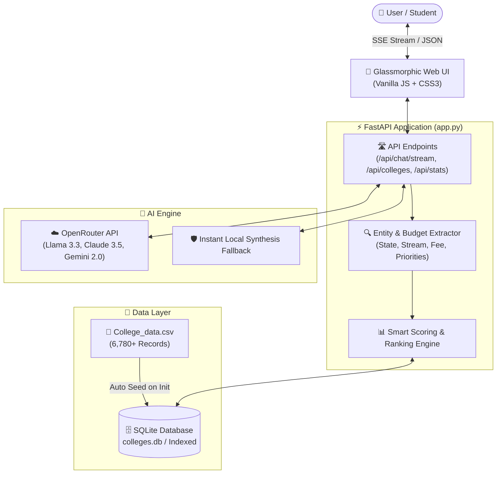

# 🎓 ASTRA AI — Higher Education AI Counselor & College Directory

<div align="center">


<p align="center">
  <strong>An intelligent, high-speed AI admission counselor and verified higher education directory covering 6,780+ Indian colleges across 28 states and 10 streams.</strong>
</p>

[Key Features](#-key-features) •
[Architecture](#-system-architecture) •
[Quick Start](#-quick-start) •
[API Reference](#-api-reference) •
[Configuration](#-environment-variables) •
[Deployment](#-deployment) •
[Live Queries](#-sample-queries)

</div>

---

## 🌟 Overview

**ASTRA AI** is an enterprise-grade AI admission counseling system designed to help students, parents, and educators make data-backed college decisions in India. 

Combining **real-time LLM reasoning** via [OpenRouter](https://openrouter.ai/) with an **indexed SQLite database of 6,780+ institutions**, ASTRA delivers instant college recommendations, multi-criteria parameter comparisons, fee analysis, and rating breakdowns through real-time streaming Server-Sent Events (SSE).

---

## ✨ Key Features

- **⚡ Real-Time Streaming Chat (SSE):** Word-by-word low-latency response generation using Server-Sent Events (`/api/chat/stream`).
- **🧠 Multi-LLM Routing via OpenRouter:** Seamlessly switch between cutting-edge models like Llama 3.3 70B, Claude 3.5 Sonnet, Gemini 2.0 Flash, DeepSeek Chat, and GPT-4o Mini.
- **📚 6,780+ Verified Indian Colleges Dataset:** Covers Engineering, Medical, Management, Law, Arts, Science, Pharmacy, and more across all 28 states.
- **⚖️ Side-by-Side Comparison Engine:** Compare colleges directly across Fees, Academics, Accommodation, Placements, Infrastructure, Faculty, and Social Life.
- **🎯 Smart NLP Entity & Budget Extraction:** Automatically detects budget ranges (e.g., *"under 5 Lakhs"*), target states, streams, and priority dimensions from natural language prompts.
- **🛡️ Instant Local RAG Fallback:** Offline-capable rule-based synthesis engine ensures 100% uptime even during network or API quota failures.
- **🎨 Glassmorphic Enterprise UI:** Sleek, responsive, dark-mode interface featuring dynamic ambient mesh, preset prompt pills, audio speech input support, and a live searchable college directory table.
- **🚀 Serverless Deployment Ready:** Optimized for zero-config deployment on Vercel, AWS Lambda, Render, or self-hosted Docker/VPS.

---

## 🏗️ System Architecture



---

## 📁 Project Structure

```text
NEW_COLLEGE_Bot/
├── 📄 app.py              # Main FastAPI application, routing, NLP engine & LLM handlers
├── 📄 College_data.csv    # Comprehensive dataset containing 6,780+ verified college records
├── 🗄️ colleges.db         # Auto-generated & indexed SQLite database
├── 📄 requirements.txt    # Production Python dependencies
├── 📄 vercel.json         # Vercel serverless deployment configuration
├── 📄 .env.example        # Environment variable configuration template
├── 📄 .env                # Local environment secrets (not committed)
├── 📄 .gitignore          # Git exclusion rules
├── 📁 api/
│   └── 📄 index.py        # Vercel serverless runtime entry point
└── 📁 static/
    ├── 📄 index.html      # Responsive Single-Page Application (SPA)
    ├── 📄 style.css       # Custom dark glassmorphism design system
    └── 📄 app.js          # Dynamic UI state, SSE streaming client & directory matrix
```

---

## 🚀 Quick Start

### 1. Prerequisites
- Python 3.10+ installed
- Git installed
- An [OpenRouter API Key](https://openrouter.ai/keys) *(optional for AI chat, offline mode works out of the box)*

### 2. Clone the Repository
```bash
git clone https://github.com/himanshu-jangra77/Astra-AI-College-Counselor-BOT.git
cd Astra-AI-College-Counselor-BOT
```

### 3. Create & Activate Virtual Environment
```bash
# Windows
python -m venv .venv
.venv\Scripts\activate

# macOS / Linux
python3 -m venv .venv
source .venv/bin/activate
```

### 4. Install Dependencies
```bash
pip install -r requirements.txt
```

### 5. Configure Environment Variables
Copy `.env.example` to `.env`:
```bash
# Windows PowerShell
copy .env.example .env

# macOS / Linux
cp .env.example .env
```

Edit `.env` with your preferred settings:
```env
PORT=8000
HOST=0.0.0.0
OPENROUTER_API_KEY=your-actual-api-key-here
OPENROUTER_MODEL=google/gemma-4-26b-a4b-it:free
FAST_MODEL=openrouter/free
YOUR_SITE_URL=http://localhost:8000
YOUR_APP_NAME=Astra-CollegeBot
```

### 6. Run the Server
```bash
python app.py
```
Open your browser and navigate to **`http://localhost:8000`**.

---

## ⚙️ Environment Variables

| Variable | Required | Default | Description |
| :--- | :---: | :--- | :--- |
| `OPENROUTER_API_KEY` | **Recommended** | `""` | OpenRouter API Key for cloud LLM reasoning |
| `OPENROUTER_MODEL` | No | `google/gemma-4-26b-a4b-it:free.3-70b-instruct` | Primary LLM model identifier |
| `FAST_MODEL` | No | `openrouter/free` | Lightweight LLM for fast responses |
| `PORT` | No | `8000` | Port for the FastAPI server |
| `HOST` | No | `0.0.0.0` | Host binding interface |
| `DB_FILE_PATH` | No | Auto-resolved | Custom path for SQLite database file |
| `YOUR_SITE_URL` | No | `http://localhost:8000` | Site URL sent in OpenRouter telemetry headers |
| `YOUR_APP_NAME` | No | `Astra-CollegeBot` | App name sent in OpenRouter telemetry headers |

---

## 📡 API Reference

### 1. Real-Time Streaming Chat
- **Endpoint:** `GET /api/chat/stream`
- **Description:** Server-Sent Events (SSE) stream delivering word-by-word AI tokens.
- **Parameters:**
  - `message` *(string, required)*: User's admission question or prompt.
  - `fast_mode` *(boolean, optional)*: Toggle fast lightweight LLM (`default: false`).
  - `model` *(string, optional)*: Specific OpenRouter model override.

### 2. Synchronous Chat
- **Endpoint:** `POST /api/chat`
- **Request Body:**
  ```json
  {
    "message": "Top computer science colleges in Bangalore under 6 Lakhs fee",
    "fast_mode": false,
    "model": null
  }
  ```
- **Response:**
  ```json
  {
    "response": "Here are the top colleges matching your criteria...",
    "source": "openrouter",
    "model": "meta-llama/llama-3.3-70b-instruct"
  }
  ```

### 3. College Directory Filter & Search
- **Endpoint:** `GET /api/colleges`
- **Parameters:**
  - `state` *(string)*: Filter by Indian state (e.g. `Tamil Nadu`, `Karnataka`, `Delhi`)
  - `stream` *(string)*: Filter by stream (e.g. `Engineering`, `Medical`, `Management`)
  - `max_fee` *(float)*: Maximum annual UG fee in INR
  - `q` *(string)*: Search text in college names
  - `limit` *(int)*: Result limit (`1-100`, default `30`)

### 4. System Metrics & Stats
- **Endpoint:** `GET /api/stats`
- **Response:**
  ```json
  {
    "total_colleges": 6788,
    "total_states": 28,
    "total_streams": 10,
    "primary_model": "google/gemma-4-26b-a4b-it:free",
    "fast_model": "openrouter/free"
  }
  ```

### 5. Health Check & Config Status
- **Endpoint:** `GET /api/health`
- **Response:**
  ```json
  {
    "status": "ok",
    "primary_model": "google/gemma-4-26b-a4b-it:free",
    "fast_model": "openrouter/free",
    "api_configured": true
  }
  ```

### 6. Reset Conversation Session
- **Endpoint:** `POST /api/reset`

---

## 💬 Sample Queries

| Goal | Example Query |
| :--- | :--- |
| **Budget Search** | *"Best engineering colleges in Maharashtra under 4 Lakhs per year"* |
| **Direct Comparison** | *"Compare VIT Vellore vs SRM Institute of Science and Technology"* |
| **Stream Filtering** | *"Top Medical colleges in Karnataka with high clinical placement ratings"* |
| **Specific Focus** | *"Colleges in Delhi NCR with best infrastructure and social life scores"* |
| **Management / MBA** | *"Top management institutes in Mumbai with affordable fees"* |

---

## 🌐 Deployment

### Deploy on Vercel
The repository includes `vercel.json` and `api/index.py` configured for Vercel's Python Serverless runtime:

1. Push your repository to GitHub.
2. Import the project into your [Vercel Dashboard](https://vercel.com).
3. Add your Environment Variables (`OPENROUTER_API_KEY`, etc.) in the Vercel Project Settings.
4. Deploy! The SQLite database will automatically initialize in `/tmp/colleges.db` on first cold start.

### Deploy with Docker / VPS / Gunicorn
```bash
# Run with Uvicorn production workers
uvicorn app:app --host 0.0.0.0 --port 8000 --workers 4
```

---

## 🛠️ Technology Stack

| Layer | Technology |
| :--- | :--- |
| **Backend Framework** | [FastAPI](https://fastapi.tiangolo.com/) (Python 3.10+) |
| **ASGI Server** | [Uvicorn](https://www.uvicorn.org/) |
| **Data Engine & Storage** | [SQLite3](https://www.sqlite.org/) + [Pandas](https://pandas.pydata.org/) |
| **AI / LLM Orchestration** | [OpenRouter](https://openrouter.ai/) (Llama 3.3, Claude 3.5, Gemini 2.0) |
| **Frontend** | Vanilla HTML5, CSS3 Glassmorphic Design System, ES6 JavaScript |
| **Streaming Protocol** | Server-Sent Events (SSE) |
| **Hosting & Serverless** | Vercel / Render / Docker |

---

## 🤝 Contributing

Contributions, issues, and feature requests are welcome!
1. Fork the repository
2. Create your feature branch (`git checkout -b feature/AmazingFeature`)
3. Commit your changes (`git commit -m 'Add some AmazingFeature'`)
4. Push to the branch (`git push origin feature/AmazingFeature`)
5. Open a Pull Request

---

## 📜 License

This project is licensed under the **MIT License** — see the [LICENSE](LICENSE) file for details.

<div align="center">
  <sub>Built with ❤️ for students across India by <a href="https://github.com/himanshu-jangra77">Himanshu Jangra</a></sub>
</div>
